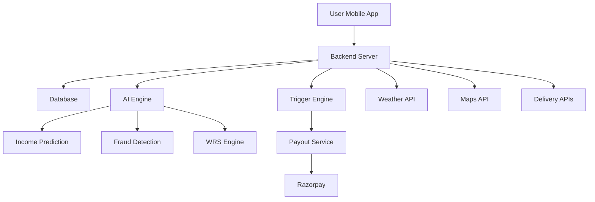

# EarnKavach-AI-Income-Stabalization

# EarnKavach 

### AI-Powered Income Stabilization Engine for Gig Workers

---

##  Problem Statement

India’s food delivery partners (Zomato, Swiggy) face significant income loss due to external disruptions such as heavy rain, extreme heat, pollution, and local restrictions. These uncontrollable factors reduce working hours and directly impact earnings.

Current systems lack **real-time, automated income protection**, leaving gig workers financially vulnerable.

---

##  Our Solution

EarnKavach is an AI-powered income stabilization platform that **predicts, prevents, and compensates income loss** using hyperlocal intelligence and parametric automation.

> “We don’t just insure income — we stabilize it.”

---

##  Target Persona

* Primary: Food Delivery Partners (Zomato, Swiggy)

---

##  Key Features

*  Income Prediction AI (Time-Series + Regression)
*  Worker Reliability Score (WRS)
*  Hyperlocal Risk Detection (Geo-fencing)
*  Smart Multi-factor Trigger Engine
*  Micro-Payout Model
*  AI-based Fraud Detection
*  Preventive Alerts
*  Multi-platform Income Tracking
*  Weekly Dynamic Premium Model

---

##  AI/ML Architecture

###  Income Prediction Model

Hybrid model combining:

* Time-Series Forecasting (LSTM / ARIMA)
* Regression (XGBoost / Random Forest)

###  Input Features:

* Historical earnings (7–30 days)
* Time of day
* Day of week
* Weather conditions
* Location demand
* Platform activity

###  Formula:

Expected Income = f(Earnings_history, Time, Weather, Demand, Location)

---

###  Worker Reliability Score (WRS)

###  Formula:

WRS = (0.3 × Activity Consistency)

* (0.25 × Order Acceptance Rate)
* (0.2 × Location Authenticity)
* (0.15 × Past Claims Honesty)
* (0.1 × Platform Rating)

---

###  Fraud Detection Model

* Isolation Forest / DBSCAN
* Behavioral anomaly detection

Detects:

* GPS spoofing
* Fake inactivity
* Duplicate claims
* Abnormal patterns

---

##  Hyperlocal Intelligence

* City divided into micro-zones (500m–1km)
* Tracks:

  * Rainfall
  * AQI
  * Traffic
  * Order density

---

##  Parametric Trigger Engine

###  Logic:

IF (Rainfall > Threshold)
AND (Orders ↓ ≥ 40%)
AND (User Active = TRUE)
THEN Trigger Claim

---

##  Micro-Payout Model

###  Formula:

Payout = Expected Income per hour × Lost Hours

---

##  Final Compensation

###  Formula:

Final Payout = (Expected Income − Actual Income) × Coverage %

---

##  Weekly Premium Model

###  Formula:

Weekly Premium = Base Rate × Risk Factor / WRS

---

##  Preventive Intelligence

* Alerts before disruption
* Suggests safer zones / time shifts

---

##  Multi-Platform Income Tracking

* Aggregates earnings across platforms
* Improves prediction accuracy

---

#  Adversarial Defense & Anti-Spoofing Strategy

##  Problem

Attackers use GPS spoofing to fake location and trigger false payouts, draining system funds. 

---

##  1. Differentiation Strategy

We move from **location-based validation → behavior-based validation**

###  Real Worker:

* Continuous movement
* Active delivery patterns
* Realistic routes

###  Fraud Actor:

* Static or unrealistic movement
* No delivery activity
* Coordinated fake claims

---

##  2. Multi-Signal Data Validation

Beyond GPS, we use:

* Accelerometer & motion data
* App activity logs
* Order pickup/drop events
* Network tower triangulation
* Device fingerprinting
* Speed & route consistency

---

##  3. Proof-of-Work Engine

We validate:

* Was the user actually working?

### Checks:

* Movement consistency
* Order handling activity
* Time spent active

---

##  4. Behavioral AI Model

* Learns normal user behavior
* Flags sudden anomalies

---

##  5. Cluster Fraud Detection

Detects coordinated fraud rings:

* Multiple users
* Same zone
* Same time
* Same inactivity

---

##  6. UX Balance (Fairness Layer)

###  Trusted → Instant payout

###  Suspicious → Delayed + verification

###  Fraud → Blocked

---

##  7. Network Failure Handling

* Supports delayed sync
* Uses cached data
* Prevents false rejection

---

##  8. Device Intelligence

Detect:

* Mock location apps
* Rooted devices
* Emulator usage

---

#  Edge Cases & Intelligent Handling

To ensure robustness, fairness, and fraud resistance, EarnKavach is designed to handle real-world complexities through the following edge-case strategies:

---

## 1️. Worker Inactive During Disruption

###  Scenario:

A disruption (e.g., heavy rain) occurs, but the worker was not actively working at that time.

###  Risk:

Unfair payouts for users who were never impacted.

###  Solution:

* Validate real-time activity logs (app usage, order acceptance)
* Cross-check historical working patterns
* Only users with active working sessions are eligible

---

## 2️. Partial Disruption (Time-bound Impact)

###  Scenario:

Disruption lasts only for a few hours instead of the entire day.

###  Risk:

Overcompensation if full-day payout is given.

###  Solution:

* Use micro-payout model
* Calculate lost hours dynamically
* Payout = Expected hourly income × Actual lost duration

---

## 3️. Location Switching to Avoid Risk

###  Scenario:

Worker moves from a high-risk zone to a safer nearby area.

###  Risk:

Incorrect payout if system still considers old location.

###  Solution:

* Continuous GPS + movement tracking
* Real-time zone reassignment using geo-fencing
* Payout only for time spent in affected zones

---

## 4️. New User with No Historical Data

###  Scenario:

A new delivery partner joins with no earning history.

###  Risk:

Inaccurate income prediction.

###  Solution:

* Use area-based average income models
* Cluster users by:

  * Location
  * Time slots
  * Platform activity
* Gradually personalize predictions as data builds

---

## 5️. Multiple Claims in Short Duration

###  Scenario:

User attempts to trigger multiple payouts within a short period.

###  Risk:

Exploitation of system liquidity.

###  Solution:

* Implement weekly payout cap
* Track claim frequency patterns
* Flag abnormal claim spikes using anomaly detection

---

## 6️. Platform Downtime vs Low Demand

###  Scenario:

Orders are low due to demand drop, not an actual disruption.

###  Risk:

False trigger of payout.

###  Solution:

* Use multi-factor trigger logic:

  * Weather conditions
  * Order volume drop
  * Traffic data
* Only trigger if all conditions align

---

## 7️. Extreme Multi-Day Disruptions

###  Scenario:

Flood or extreme weather lasts multiple days.

###  Risk:

Unlimited payouts → financial instability.

###  Solution:

* Apply rolling payout cap
* Introduce progressive compensation model
* Reduce payout percentage after threshold duration

---

## 8️. GPS Spoofing (Fake Location Fraud)

###  Scenario:

User fakes location in a high-risk zone using spoofing tools.

###  Risk:

Mass false payouts.

###  Solution:

* Multi-signal validation:

  * GPS + motion sensors
  * Route consistency
  * App activity
* Detect unrealistic movement patterns
* Integrate with fraud detection AI

---

## 9️. Coordinated Group Fraud Attack

###  Scenario:

Large group of users simultaneously fake claims from same zone.

###  Risk:

System-wide financial drain.

###  Solution:

* Implement cluster anomaly detection
* Identify:

  * Sudden surge in claims
  * Similar behavior patterns
* Flag and block suspicious clusters

---

## 10. Network Loss During Disruption

###  Scenario:

Worker loses internet connectivity due to bad weather.

###  Risk:

Valid users may be unfairly rejected.

###  Solution:

* Enable offline data caching
* Allow delayed sync of activity logs
* Validate based on last known behavior

---

## 11. Unrealistic Movement Patterns

###  Scenario:

User location jumps between distant areas instantly.

###  Risk:

Indicates GPS spoofing or emulator usage.

###  Solution:

* Detect speed anomalies
* Validate route continuity
* Reject non-physical movement patterns

---

## 12. Idle User Claiming Continuous Work

###  Scenario:

User claims full-day disruption but shows no activity.

###  Risk:

False compensation.

###  Solution:

* Verify order handling logs
* Compare with historical activity baseline
* Use WRS to reduce trust score

---

## 13. Overlapping Disruption Events

###  Scenario:

Multiple triggers occur simultaneously (rain + traffic + strike).

###  Risk:

Duplicate payouts.

###  Solution:

* Merge triggers into single compensation event
* Prioritize highest-impact disruption
* Prevent double-counting

---

## 14. Device Manipulation / Emulator Usage

###  Scenario:

User uses emulator or rooted device to manipulate data.

###  Risk:

Bypassing system checks.

###  Solution:

* Device fingerprinting
* Detect rooted/emulated environments
* Restrict high-risk devices

---

## 15. Sudden Behavioral Deviation

###  Scenario:

A previously normal user suddenly shows abnormal patterns.

###  Risk:

Account compromise or fraud attempt.

###  Solution:

* Behavioral AI model detects deviations
* Temporarily flag account
* Move user to **verification tier (UX layer)**

---

##  System Architecture

---

##  Workflow

1. User registers
2. Risk & premium calculated
3. Income predicted
4. Disruption monitored
5. Preventive alerts sent
6. Trigger activated
7. Claim auto-processed
8. Instant payout

---

##  Dashboard

### Worker:

* Earnings vs predicted
* Coverage
* Alerts

### Admin:

* Fraud alerts
* Risk heatmaps
* Analytics

---

##  Future Scope

* Blockchain transparency
* Advanced prediction models
* Expansion to all gig sectors

---

##  Demo Video

(Add your link here)

---

##  Team

**Synergy Squad**

* Utkarsh Arora
* Sudhansu Shukla
* Akanksha Khantwal
* Sanya Kumari
* Shaurya Vardhan Yadav

---

##  Conclusion

EarnKavach transforms insurance into an "AI-driven real-time income protection system", ensuring financial stability for gig workers even under unpredictable disruptions.

---
